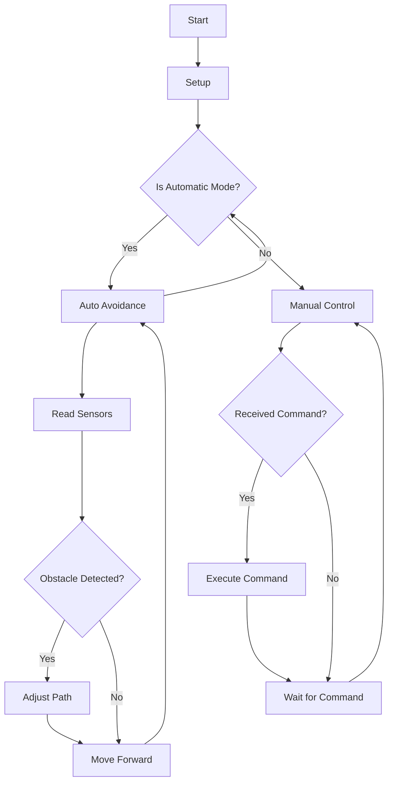

# Arduino Car Project

This project is an Arduino-based robot that uses ultrasonic sensors, infrared sensors, and Bluetooth for control. The robot can operate in both automatic and manual modes, avoiding obstacles and being controlled remotely.

## Components

- Arduino board
- Ultrasonic sensor
- Infrared sensors
- DC motors with motor driver shield
- Servo motor
- LCD display (I2C)
- Bluetooth module

## Features

- **Automatic Mode**: The robot navigates and avoids obstacles using the ultrasonic and infrared sensors.
- **Manual Mode**: The robot can be controlled remotely via Bluetooth.
- **LCD Display**: Displays status messages and sensor readings.

## Installation

1. Connect the components as described in the code.
2. Upload the `2nd.cpp` file to your Arduino board using the Arduino IDE.
3. Pair the Bluetooth module with your controlling device if manual control is required.

## Usage

- Switch between automatic and manual mode by sending the 'S' command.
- In manual mode, control the robot with the following commands:
  - 'F': Move forward
  - 'B': Move backward
  - 'L': Turn left
  - 'R': Turn right

## Code Overview

- **setup()**: Initializes sensors, motors, and the LCD display.
- **loop()**: Handles mode switching and commands.
- **autoAvoidance()**: Logic for automatic obstacle avoidance.
- **Manual control functions**: Functions to control the robot's movements manually.

## Flowchart

